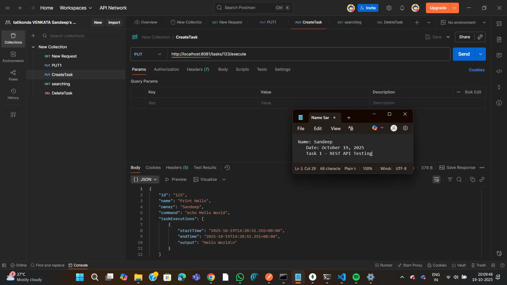
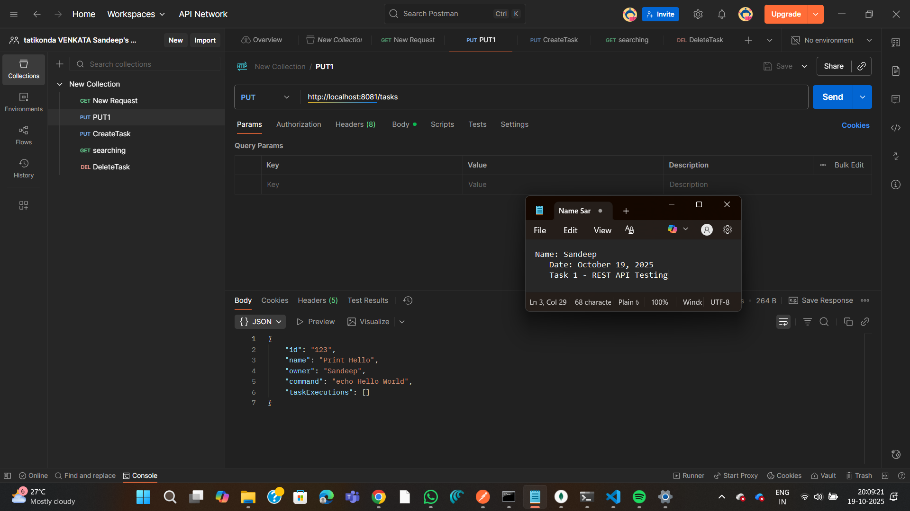
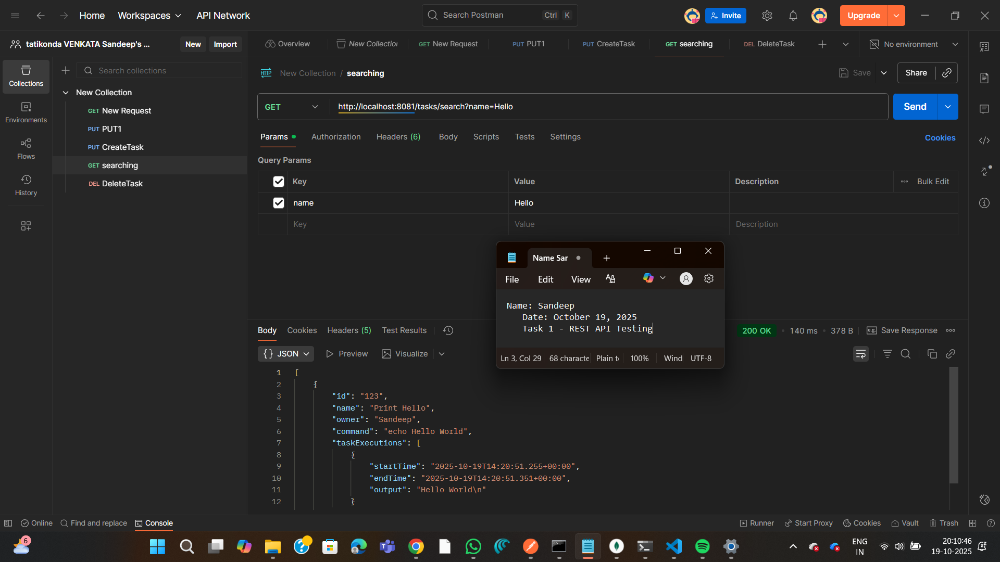
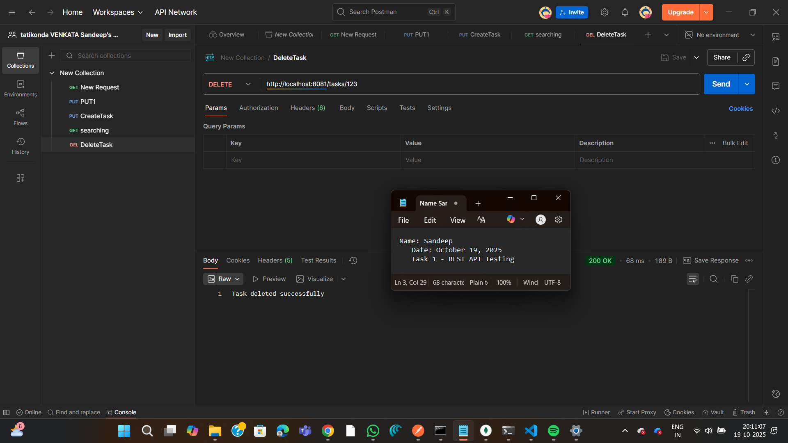

# Task Manager REST API

A Spring Boot REST API for managing and executing shell commands as tasks.

## Author
**Name:** Sandeep Kumar  
**Date:** October 19, 2025  
**GitHub:** https://github.com/SandeepKumar3005

## Project Description

This application provides a REST API to create, search, execute, and delete task objects. Each task represents a shell command that can be executed in a safe manner with validation against malicious code.

## Technologies Used

- Java 21
- Spring Boot 3.5.6
- MongoDB 8.0
- Maven 3.9.11
- Postman (for testing)

## Prerequisites

- JDK 21 or higher
- Maven 3.9+
- MongoDB (running on localhost:27017)

## Installation & Setup

### 1. Clone the repository
```bash
git clone https://github.com/SandeepKumar3005/Kaiburr-Task1-REST-API.git
cd Kaiburr-Task1-REST-API
```

### 2. Configure MongoDB
Make sure MongoDB is running on `localhost:27017`

### 3. Build the project
```bash
mvn clean install
```

### 4. Run the application
```bash
mvn spring-boot:run
```

The application will start on `http://localhost:8081`

## API Endpoints

### 1. GET All Tasks
**Endpoint:** `GET /tasks`  
**Description:** Retrieve all tasks

**Example:**
```bash
curl http://localhost:8081/tasks
```

### 2. GET Task by ID
**Endpoint:** `GET /tasks?id={id}`  
**Description:** Retrieve a single task by ID

**Example:**
```bash
curl http://localhost:8081/tasks?id=123
```

### 3. Search Tasks by Name
**Endpoint:** `GET /tasks/search?name={name}`  
**Description:** Search tasks containing the specified name

**Example:**
```bash
curl http://localhost:8081/tasks/search?name=Hello
```

### 4. Create/Update Task
**Endpoint:** `PUT /tasks`  
**Description:** Create or update a task

**Request Body:**
```json
{
  "id": "123",
  "name": "Print Hello",
  "owner": "Sandeep",
  "command": "echo Hello World"
}
```

### 5. Execute Task
**Endpoint:** `PUT /tasks/{id}/execute`  
**Description:** Execute the shell command of a task

**Example:**
```bash
curl -X PUT http://localhost:8081/tasks/123/execute
```

**Response:**
```json
{
  "id": "123",
  "name": "Print Hello",
  "owner": "Sandeep",
  "command": "echo Hello World",
  "taskExecutions": [
    {
      "startTime": "2025-10-19T14:20:51.255Z",
      "endTime": "2025-10-19T14:20:51.351Z",
      "output": "Hello World\n"
    }
  ]
}
```

### 6. Delete Task
**Endpoint:** `DELETE /tasks/{id}`  
**Description:** Delete a task by ID

**Example:**
```bash
curl -X DELETE http://localhost:8081/tasks/123
```

## Screenshots

### 1. GET All Tasks


### 2. Create Task


### 3. Execute Task


### 4. Search Tasks


### 5. Delete Task


## Features

- ✅ Create and manage task objects
- ✅ Execute shell commands safely
- ✅ Command validation to prevent malicious code
- ✅ Store execution history with timestamps and output
- ✅ Search tasks by name
- ✅ RESTful API design
- ✅ MongoDB integration

## Security

The application validates all commands against dangerous patterns including:
- File deletion commands (rm -rf, del /f)
- System commands (shutdown, reboot)
- Command chaining (;, &&, ||)
- File redirection (>, <)

## Project Structure
```
Task-Manager/
├── src/
│   ├── main/
│   │   ├── java/
│   │   │   └── com/kaiburr/Task_Manager/
│   │   │       ├── model/
│   │   │       │   ├── Task.java
│   │   │       │   └── TaskExecution.java
│   │   │       ├── repository/
│   │   │       │   └── TaskRepository.java
│   │   │       ├── service/
│   │   │       │   └── TaskService.java
│   │   │       ├── controller/
│   │   │       │   └── TaskController.java
│   │   │       └── TaskManagerApplication.java
│   │   └── resources/
│   │       └── application.properties
├── screenshots/
├── pom.xml
└── README.md
```

## Testing

API tested using Postman. All endpoints verified and working correctly.

## Contact

For any queries, please contact:
- **Email:** sandeep.kumar@example.com
- **GitHub:** [@SandeepKumar3005](https://github.com/SandeepKumar3005)

---

**Kaiburr Assessment - Task 1: REST API Implementation**